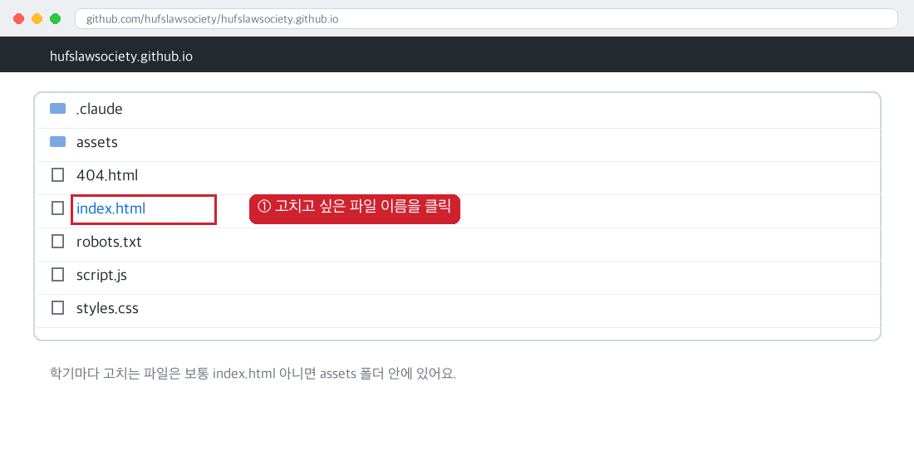
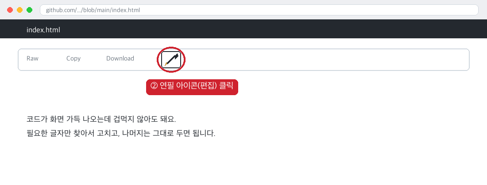
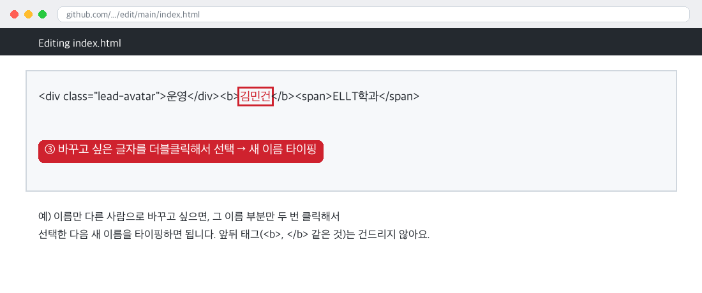
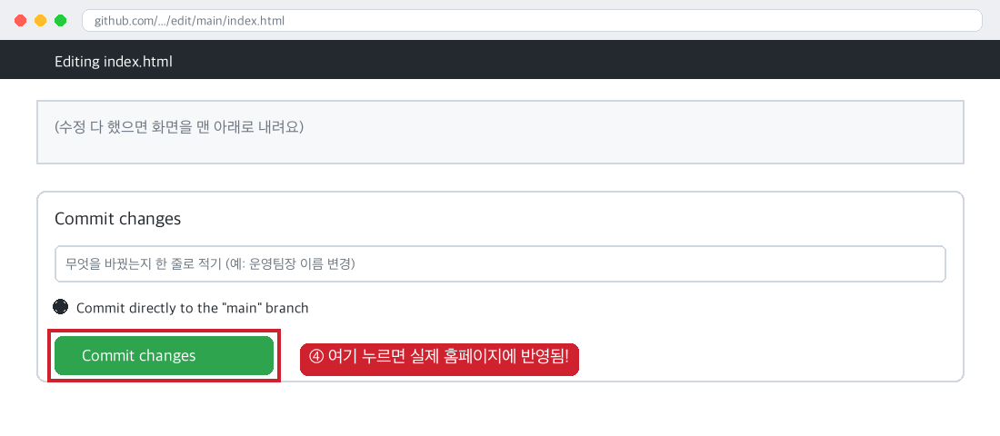
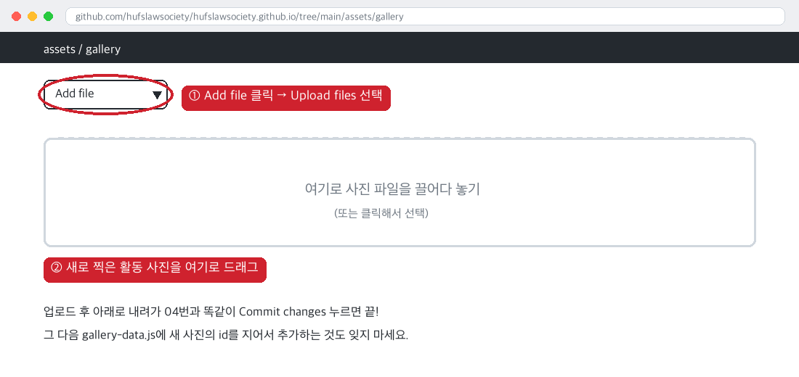

# 외대법학회 홈페이지 관리 가이드

이 문서는 홈페이지를 처음 맡은 사람도 볼 수 있게, **아주 쉽게** 설명한 문서입니다.
컴퓨터를 잘 몰라도 괜찮습니다. 아래 그림을 보면서 순서대로 클릭만 따라 하면 됩니다.

> 홈페이지 주소: https://hufslawsociety.github.io/
> 이 홈페이지의 "원본 재료"는 전부 여기 github.com 이라는 웹사이트 안에 저장되어 있습니다.
> 여기서 글자만 고치고 저장 버튼을 누르면, 1분쯤 뒤에 실제 홈페이지에도 똑같이 반영됩니다.

---

## 0. 이 문서 사용법

- 컴퓨터에 아무것도 설치할 필요 없습니다. **인터넷 창(크롬 등)만 있으면 됩니다.**
- 아래 "공통 방법"을 먼저 한 번 읽어보세요. 모든 작업이 이 4단계를 반복하는 것뿐입니다.
- 그다음 "이런 상황일 때" 목차에서 지금 필요한 것만 찾아서 따라 하면 됩니다.
- 틀려도 절대 큰일 안 납니다. 언제든 이전 상태로 되돌릴 수 있어요 (맨 아래 "잘못 고쳤을 때" 참고).

---

## 공통 방법: 글자 하나 고치는 법 (모든 작업의 기본)

어떤 걸 고치든 아래 4단계는 항상 똑같습니다.

**① 저장소(github.com)에 들어가서, 고치고 싶은 내용이 들어있는 파일을 클릭합니다.**



**② 파일이 열리면, 오른쪽 위에 있는 연필 모양 아이콘(편집 버튼)을 클릭합니다.**



**③ 화면에 코드가 잔뜩 나오는데, 겁먹지 마세요. 고치고 싶은 글자만 두 번(더블) 클릭해서 선택하고, 새 내용을 타이핑하면 됩니다.**



> ⚠️ **주의**: `< >` 로 둘러싸인 부분(예: `<b>`, `</div>`)은 절대 건드리지 마세요.
> 그 사이에 있는 글자(이름, 숫자, 문장)만 바꾸면 안전합니다.

**④ 다 고쳤으면 화면을 맨 아래로 내려서, 초록색 "Commit changes" 버튼을 누릅니다. 이게 "저장" 버튼입니다.**



이 버튼을 누르면 끝입니다! 1~2분 안에 실제 홈페이지( https://hufslawsociety.github.io/ )에 반영됩니다.
새로고침(F5)해서 확인해보세요.

---

## 이런 상황일 때 (목차)

1. [새 학기가 시작됐어요 (기수/학기 숫자 바꾸기)](#1-새-학기가-시작됐어요)
2. [임원진이 바뀌었어요 (이름 바꾸기)](#2-임원진이-바뀌었어요)
3. [연혁에 이번 학기 기록을 추가하고 싶어요](#3-연혁에-이번-학기-기록을-추가하고-싶어요)
4. [대표 전화번호를 넣고 싶어요](#4-대표-전화번호를-넣고-싶어요)
5. [새 모집공고를 올리고 싶어요](#5-새-모집공고를-올리고-싶어요)
6. [활동 사진을 추가하고 싶어요](#6-활동-사진을-추가하고-싶어요)
7. [잘못 고쳤을 때 (되돌리기)](#7-잘못-고쳤을-때-되돌리기)

---

## 1. 새 학기가 시작됐어요

"13기", "2026-2" 같은 숫자가 페이지 여러 곳에 나오는데, **딱 한 파일만 고치면 전부 자동으로 바뀝니다.**

1. 저장소에서 `assets` 폴더 → `site-config.js` 파일을 클릭합니다.
2. 공통 방법 ①~④번을 따라, 아래 4줄의 따옴표 안 내용만 바꿉니다.

```
generation: "13기",       →  "14기" 로 바꾸기
semester: "2026-2",       →  "2026-2" 또는 "2027-1" 등 이번 학기로 바꾸기
programCount: "12",       →  이번 학기 정기 프로그램 개수
teamCount: "5",           →  이번 학기 운영 팀 개수
```

3. 저장(Commit changes)하면 끝. 히어로 화면, 소개 화면, 조직도 제목, 활동 배지까지 전부 한 번에 바뀝니다.

---

## 2. 임원진이 바뀌었어요

1. 저장소에서 `index.html` 파일을 클릭합니다.
2. 편집 화면에서 **`org-lead-grid`** 라는 글자를 찾습니다 (Ctrl+F 또는 Cmd+F로 화면 안에서 찾기 가능).
   그 바로 아래 3줄에 회장·부회장·운영팀장 이름과 학과가 있습니다.
3. 이름과 학과만 새 사람 것으로 바꿉니다. (앞서 만든 예시 그림과 똑같은 방식입니다 — 위 "공통 방법" ③번 그림 참고)
4. 저장하면 끝.

> 회장 자리에 새 사람이 왔다면, [4번 전화번호](#4-대표-전화번호를-넣고-싶어요)도 같이 바꿔주는 걸 잊지 마세요.

---

## 3. 연혁에 이번 학기 기록을 추가하고 싶어요

이건 자동으로 안 되고, **새 줄을 하나 손으로 추가**해야 합니다. (지난 학기 기록은 계속 남아있어야 하기 때문이에요.)

1. `index.html` 파일 편집 화면에서 **`class="timeline"`** 을 찾습니다.
2. 그 안에 있는 **가장 마지막** 항목(제일 최근 학기)을 통째로 복사해서, 바로 아래에 붙여넣습니다.
3. 방금 붙여넣은 새 항목의 학기/기수/내용을 이번 학기 것으로 고칩니다.
4. **중요**: 방금 붙여넣은 새 항목에만 `active` 라는 단어가 들어가 있어야 합니다.
   원래 마지막 항목(이전 학기)에는 `active` 단어를 지워주세요. (금색으로 강조 표시되는 게 이 단어 때문입니다)
5. 저장하면 끝.

---

## 4. 대표 전화번호를 넣고 싶어요

1. `index.html` 파일 편집 화면에서 **`학회 대표 연락처를 입력해주세요`** 라는 글자를 찾습니다.
2. 그 문장 전체와 바로 뒤에 있는 `<span class="placeholder-tag">입력 필요</span>` 부분을,
   실제 전화번호(예: `010-1234-5678`)로 통째로 바꿉니다.
3. 저장하면 끝.

---

## 5. 새 모집공고를 올리고 싶어요

1. 먼저 [6번(사진 올리기)](#6-활동-사진을-추가하고-싶어요) 방법과 똑같이, `assets/notices` 폴더에 모집 포스터 이미지를 올립니다.
2. `assets` 폴더 → `notices-data.js` 파일을 클릭 → 편집(연필) 아이콘 클릭.
3. 맨 위쪽, 이미 있는 모집공고 덩어리 하나를 통째로 복사해서 그 위에 붙여넣습니다.
4. 붙여넣은 내용에서 `id`, `title`, `date`, `images`, `bodyHtml`(공고 본문)을 이번 학기 내용으로 바꿉니다.
   `id`는 다른 것과 안 겹치게 아무 영어 이름이나 지으면 됩니다 (예: `recruit-14th-1`).
5. 저장하면 끝. 이제 홈페이지 공지사항 목록 맨 위에 새 공고가 뜹니다.

---

## 6. 활동 사진을 추가하고 싶어요

**사진 올리기:**

1. 저장소에서 `assets` 폴더 → `gallery` 폴더로 들어갑니다.
2. 오른쪽 위 **"Add file"** 버튼을 누르고 **"Upload files"** 를 선택합니다.



3. 새로 찍은 활동 사진 파일을 화면 가운데로 끌어다 놓습니다.
4. 저장(Commit changes)하면 사진 업로드 끝.

**사진을 활동 카드에 연결하기:**

5. `assets` 폴더 → `gallery-data.js` 파일을 클릭 → 편집(연필) 아이콘 클릭.
6. **`const GALLERY`** 부분 맨 밑에 새 줄을 하나 추가합니다. 예를 들어 이렇게:
   ```
   { id: "seminar-14-0310", src: "assets/gallery/새로올린파일이름.jpg", caption: "14기 세미나 · 2027.03.10" },
   ```
   (`id`는 아무 이름이나 겹치지만 않으면 됩니다. `src`는 방금 올린 사진 파일 이름과 똑같이 적어야 합니다.)
7. 아래쪽 **`const ACT_PHOTOS`** 부분에서, 이 사진을 보여주고 싶은 활동 번호를 찾아, 방금 지은 `id`를 그 배열 안에 추가합니다.
   ```
   '08':['seminar-12-0512', 'seminar-14-0310'],
   ```
8. 저장하면 끝.

> 숫자를 세거나 순서를 신경 쓸 필요가 전혀 없습니다. 이름(`id`)만 정확히 맞으면 됩니다.
> 만약 이름을 잘못 적으면, 사이트는 그냥 그 사진을 무시할 뿐이라 안전합니다.

---

## 7. 잘못 고쳤을 때 (되돌리기)

너무 걱정하지 마세요. github.com은 **지금까지 저장한 모든 순간을 전부 기억**하고 있어서, 언제든 이전 상태로 돌아갈 수 있습니다.

1. 저장소 메인 화면에서 오른쪽 위 **"History"** (또는 시계 모양 아이콘)를 클릭합니다.
2. 문제가 생기기 전, 정상이었던 시점을 찾아 클릭합니다.
3. 그 화면에서 파일 내용을 복사해서, 지금 파일에 그대로 덮어쓰고 저장하면 원래대로 돌아갑니다.

정 모르겠으면 당황하지 말고, 무엇을 하다가 어떻게 됐는지 캡처해서 이전 관리자나 개발 도와준 사람에게 물어보세요.
